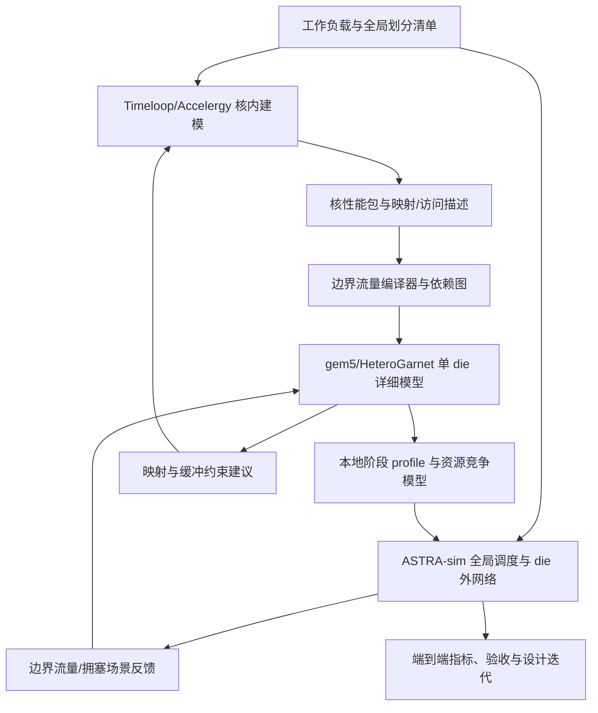

# Timeloop/Accelergy — gem5/HeteroGarnet — ASTRA-sim 跨层仿真方案

版本：v0.1，三方接口评审稿　｜　日期：2026-09-19

适用团队：计算核建模团队、die 内互连团队、多 die／多卡系统团队。

**实施建议：先完成依赖驱动的单 die 仿真，再完成分阶段、无重叠的多 die 基线，最后升级为带资源竞争和双向反压的事件耦合。** 三个平台共用一份工作负载语义与资源归属表，不相加三个平台各自报告的总时间。

本文中的接口文件、字段、适配器和在线耦合协议均为本项目建议开发的内容，除明确引用的原生能力外，不代表平台开箱即用。示例参数为人工构造的接口验收值，不是芯片预测值，也不是已运行的 gem5/ASTRA-sim 结果。当前交付包含方案、可解析 JSON 示例和契约校验脚本，不包含三个仿真器的实现与联调。

## 1. 目标、范围与第一版约束

### 1.1 需要回答的工程问题

1. 固定计算核与映射，NoC 拓扑、带宽、缓冲深度、路由和时钟变化怎样影响任务完成时间？
2. 计算端点、共享 SRAM、内存服务端点与 D2D 端口之间，哪些链路及端口成为瓶颈？
3. 同一任务拆到多个 die 后，计算收益能否覆盖额外的本地搬运、D2D 传输及同步？
4. 外部通信与本地访存竞争时，计算实际能重叠多少通信？
5. 改变映射、分块或通信算法后，端到端性能和能耗是否改善？

### 1.2 默认建模边界

| 项目 | 本方案默认值 | 改变时的影响 |
|---|---|---|
| 计算端点 | 一个 cluster／计算核簇作为黑盒；内部 MAC、寄存器和私有存储由计算团队建模 | 端点粒度变化要重生成流量与 profile |
| 核外存储 | gem5 团队提供共享 SRAM／内存服务端点；第一版可采用有队列的抽象服务模型 | 需要 DRAM bank 细节时再接控制器模型 |
| 通信语义 | 非一致性、显式 DMA／消息传输 | AXI/CHI/CXL 一致性与协议验证另立范围 |
| 首个工作负载 | 固定形状、固定映射的 dense GEMM，之后增加多算子链和 collective | 稀疏动态形状需要增加元数据与条件分支语义 |
| 第一版多 die | rank 与 die 一一对应，每个 rank 的本地阶段由 gem5 整体表征 | 不得把 die 内 cluster 直接当独立 rank 而丢失共享资源 |
| 第一版功耗 | 先验收性能；能耗覆盖范围随报告显式给出 | 缺少外部 PHY／网络能耗时不得声称“整机总能耗” |
| 运行方式 | 推荐 Linux 构建运行，Windows 工作区可负责配置、分析与文档 | 本文未验证当前 Windows 主机上的仿真器构建 |

这些默认值用于启动开发，可由三方修改，但任何变化都必须生成新的配置版本。核心团队仍拥有核内性能模型，你不需要实现指令级或 MAC 阵列内部仿真。

## 2. 系统结构与唯一计账原则



图中的反馈在第一阶段是离线实验反馈；在线事件反馈只在后续耦合版本启用。不要把离线闭环称为严格同步联合仿真。

### 2.1 时延与能耗归属表

| 资源／事件 | 唯一性能计账方 | 唯一能耗计账方 | 接口边界 |
|---|---|---|---|
| 核内计算、私有 buffer、核内数据搬运 | Timeloop 团队定义服务时间；gem5 按该时间执行黑盒事件 | 核内 Accelergy 包 | 计算簇的输入／输出逻辑端口 |
| 核外 DMA、NI、NoC 路由器与链路 | gem5 | gem5 活动计数 × 经校准能耗模型 | 核端口至共享存储／D2D 队列 |
| 共享 SRAM、所选 HBM 服务 | gem5 侧的存储服务模型 | 对应存储模型，或 Accelergy 独立条目 | 请求到服务完成；不归 ASTRA remote memory 重复建模 |
| D2D TX/RX 有限队列 | gem5 侧边界端点 | gem5 边界模型 | TX 入队接受、RX 入队接受 |
| D2D 外部控制器、协议开销、PHY、die 间链路 | ASTRA 团队选定的后端／扩展模型 | ASTRA 团队提供外部能耗模型 | TX 队列出队到对端 RX 队列入队 |
| 卡间／机间链路与交换网络 | ASTRA 及其网络后端 | 对应外部网络模型 | 对应端点的消息传输 |
| collective 算法及跨 rank 依赖 | ASTRA 系统层 | 算法展开后的物理活动所属资源 | collective 完成条件 |
| 全局总时间、关键路径、全局静态能耗汇总 | 全局调度／结果汇总器 | 汇总器只汇总独占条目 | 同一 run 的起止时刻 |

D2D 队列、控制器和 PHY 的具体切分可调整，但需要同时更新接口、时延与能耗清单。HeteroGarnet 内部的 CDC/宽度转换只计算 die 内已经放入 gem5 的部分，外部 PHY 串行化由 ASTRA 侧承担。

每条性能／能耗记录带 `component_id`、`owner`、`scope_id`、`charge_id`、`model_revision`。`scope_id` 定义建模范围，`charge_id` 唯一标识某事件/阶段的活动收费；同一 NoC 可服务多个阶段，但同一次活动不能重复收费。静态能耗还要核对组件和时间区间不能重叠收费。禁止同一物理资源有两个性能模型同时仲裁；也禁止存在未声明的未建模部分。

### 2.2 时间和能耗的计算口径

- `T_system = 最后一个要求完成的事件时刻 - workload_release_time`，不能用 `T_timeloop + T_gem5 + T_astra`。
- 核服务时间包含声明过的核内约束，但不包含交给 gem5 的核外 NoC／共享存储等待。不能直接从一个聚合总周期中减去估算网络时间来得到“纯计算时间”。
- 存在重叠时，不同队列等待和活动时长可同时发生；诊断计数不能直接相加为总延迟。关键路径报告使用真实依赖和资源占用边。
- 动态能耗按活动计数计账；静态能耗按全局实际驻留时长和功耗状态积分。等待延长的漏电不可仍沿用孤立算子的运行时间。
- 本地 profile 内若包含多个核并行，其 `duration` 是阶段 makespan，不能把各核时长再次相加。

## 3. 三个团队的交付契约

### 3.1 计算核心团队：交付“可解释的计算服务与边界访问”，不只给 stats

**接收输入**：算子形状、数据类型、核硬件配置、映射约束、私有 buffer 容量、核边界定义；由系统团队提供分片方案，由 die 团队提供允许的端口与资源约束。

**必须交付**：

| 交付物 | 必填内容 | die 团队验收规则 |
|---|---|---|
| `core_manifest.json` | workload/core/mapping 标识及 hash；工具版本、命令、容器；计时与能耗范围 | 相同输入能复现；hash 对应文件齐全 |
| `core_service.jsonl` | 每个阶段的 `phase_id, endpoint_id, service_cycles, clock_hz, included_components, excluded_components` | 核外等待被排除或明确标为不可拆分；时钟明确 |
| `boundary_access.jsonl` | 读写／搬运类型、tensor 区间、分块、源／目的逻辑端点、字节、依赖、数据生产／消费里程碑 | 可建立合法 DAG；流量与映射相符 |
| `resources.json` | 私有输入／输出缓冲容量、双缓冲策略、计算槽数、DMA 限制、允许的重叠 | 占用／释放时机能确定 |
| `core_energy.json` | 动态能耗或动作计数+ERT；泄漏功率／状态；工艺、电压、频率及覆盖范围 | 核内独占条目与共享／核外条目可区分 |
| 原生输入输出 | architecture、workload、mapping、stats、ERT/ART、运行日志；使用 trace 时提供 trace | 原生结果与适配后计数可追溯 |

**关键协作要求**：核心团队对“映射如何形成边界访问”负责。die 团队可以实现通用编译器，但不能凭总访存量猜测张量分片、复用和产生顺序。

Timeloop 的统计与 mapping 可提供周期和分层访问信息；其 trace 是循环巢分析的空间／时间坐标访问点集，需要额外解释才能成为网络请求。不能把 trace 坐标直接当 gem5 tick。详细 trace 成本较高，只对选定映射做校验。[S1][S2]

**无法交付细粒度访问时的降级方案**：使用“输入全部到齐 → 计算 → 输出全部产生”的阶段模型，明确标注 `fidelity=phase_atomic`，禁止宣称模拟了核内部流式重叠。后续将阶段细化到 tile，核心团队仍只交付服务契约。

### 3.2 你负责的 die 团队：交付“依赖驱动的详细模型与有适用域的 profile”

**接收输入**：计算核心包、端点映射、NoC/存储配置、ASTRA 提供的外部到达／接收能力场景。

**必须交付**：

| 交付物 | 内容 | 消费方 |
|---|---|---|
| `die_arch.json` | 路由器、链路、时钟、位宽、VC/vnet、buffer、DMA、存储服务、边界队列 | 核心／ASTRA 团队与复现流水线 |
| `die_events.jsonl` | 每个阶段及 transfer 的 ready/accept/start/complete；分包关联；阻塞原因 | 调试与系统校准 |
| `die_profile.json` | 本地阶段服务时间、外发准备／入站搬运成本、动态活动计数、适用域、校验误差 | ASTRA 适配器 |
| `boundary_trace.jsonl` | 外发 chunk 就绪、接收容量及入站数据消费事件；参考时序的生成条件 | ASTRA 场景重放／后续在线耦合 |
| `die_metrics.json` | 完成时间、端点等待、链路利用率、队列 occupancy、分位延迟、能耗覆盖率 | 三方评审 |
| `calibration_report.md` | 校准集、独立验证集、参数范围、误差、失效场景 | 系统团队决定是否可复用 |

profile 的 cache key 至少包含：核包 hash、mapping、NoC/存储 hash、端点映射、chunk 方案、并发策略、时钟／电压、外部负载场景及模型版本。

建议 profile 中每个条目至少采用下面的结构。此例是样例中 load0+comp0 的聚合，数值仍为人工 golden；实际条目由 gem5 运行产生。

```json
{
  "profile_id": "example.die0.phase0",
  "schema_version": "0.1",
  "mode": "phase_atomic_serial",
  "covered_node_ids": ["load0", "comp0"],
  "included_scopes": ["die0.core_private", "die0.local_path"],
  "excluded_node_ids": ["egress0", "fabric01", "ingress1"],
  "duration_ps": 1128000,
  "validity": {
    "input_payload_bytes": 1024,
    "concurrent_local_phases": 1,
    "external_background_traffic": "none",
    "requires_empty_initial_queues": true
  },
  "energy_status": "unknown",
  "on_out_of_domain": "reject_and_reprofile"
}
```

正式条目还必须包含上述 cache key 的实际 hash、样本数、校准/验证来源和误差字段。替换成此 profile 后，ASTRA 输入中移除原来的 load0/comp0 独立计时，只保留对应聚合节点及它的输入输出依赖；egress0 仍单独计时。若阶段开始时队列非空，不能使用这个声明“初始队列为空”的条目。

### 3.3 ASTRA-sim 团队：交付“明确的分布式执行计划与边界工作负载”

**接收输入**：全局 workload DAG、rank/die/card/node/rack 映射、die profile、端口能力及适用域、外部网络配置。

**必须提供给你**：

| 交付物 | 必填内容 |
|---|---|
| `partition_plan.json` | 每个算子/张量分片放在哪个 rank/die；rank 到物理节点的映射 |
| `communication_plan.json` | P2P 匹配标识；collective ID、组、类型、每 rank 逻辑输入/输出大小、算法和分块 |
| `fabric_arch.json` | 各层拓扑、链路方向、带宽/时延单位、协议开销、NIC 并发、排队/拥塞模型、PHY 计账边界 |
| `boundary_scenario.jsonl` | 来自哪个 peer、哪个端口、多少字节、依赖或场景到达时刻、接收服务条件；记录出处 |
| `system_events.jsonl` | 全局阶段、通信、匹配完成、资源阻塞事件；与 die 日志共享 ID |
| `system_metrics.json` | 端到端完成时间、吞吐、暴露通信、关键路径、网络活动、误差与模型覆盖 |
| 复现包 | ASTRA/Chakra/后端的精确 revision、补丁、构建参数、命令、seed、配置和 ET |

**对系统团队的限制**：不能把 die profile 当作任意负载下不变的标量；不能在已包含本地存储成本的阶段上重复启用对应内存收费；不能在没有资源模型的情况下默认计算、DMA、collective 都可完全重叠。

collective 逻辑字节与展开后链路字节分开统计。例如 ring AllReduce 的逻辑输入为每 rank N 字节，不能先由上游乘算法传输倍数，再让 ASTRA 再展开一次。

## 4. 平台中立接口 IR v0.1

### 4.1 文件包及版本管理

建议每次实验产生不可变目录 `runs/<run_id>/`，包含 `manifest.json`、`workload.json`、三个团队的配置、原生输入输出、统一事件日志、校验结果与报告。发布包记录完整文件 hash；目录生成完成后再设置 `status=complete`，中断结果不得进入缓存。

版本分别记录 `schema_version`、`model_revision`、工具提交号。字段增补可增加 minor 版本；单位、完成语义或 owner 变化必须增加 major 版本并重新生成 profile。未知的必需能力直接报错，禁止静默忽略。

### 4.2 单位与标识

| 字段 | 约定 |
|---|---|
| 时间 | 跨平台统一非负整数 `*_ps`；每次转换记录 rounding 和误差。不能用无单位的 cycles |
| 源周期 | `service_cycles` 与 `clock_hz` 同时提供；`duration_ps = ceil(cycles × 10^12 / Hz)` |
| 带宽 | 整数 `bandwidth_Bps`，B 表示 byte；不混用 bit/s、GB/s、GiB/s |
| 数据量 | `payload_bytes`、每层 `header_bytes`、`wire_bytes`、padding 分开；稀疏元数据独立计数 |
| 能量／功率 | 规范值 `energy_pJ`、`leakage_mW`；缺失为 unknown，不写 0 |
| 标识 | 全局 `run_id/node_id/transfer_id/chunk_id`；资源 ID 包含 die 命名空间 |
| rank | 通信参与者；与 die/card/node/rack 通过显式映射连接，后续允许多 rank/die |
| 时钟 | 每个资源的时钟域显式列出；同 tick 事件按确定性的事件优先级处理 |

ps 是交换格式，不承诺所有后端都有 ps 分辨率。初始化时进行 `time_resolution_ps` 能力协商，不能满足误差预算时拒绝运行或显式降级。

### 4.3 节点语义

| 节点种类 | 核心字段 | 完成条件 |
|---|---|---|
| `compute` | endpoint、service_cycles/clock_hz、service_time_scope、resource_id | 输入可用且占有计算资源后，服务计时结束 |
| `local_transfer` | src/dst、payload、transfer/chunk/tensor ID、destination buffer | 所有分包交付到指定目的缓冲，目的端接受 |
| `fabric_transfer` | src/dst 边界端点、匹配 ID、payload、通信组上下文 | 外部传输完成且目的 RX 预留空间接受 |
| `collective` | group、collective ID、类型、logical bytes in/out、算法策略 | 所选算法对该参与者所需的传输与归约全部完成 |
| `barrier` | participants、依赖 | 指定参与者都到达；与数据传输完成区分 |

所有节点具有 `deps`（前驱完成依赖）、`release_ps`（最早允许时间）、`owner`、`scope_id`。实际开始时刻由依赖、缓冲、资源和反压共同决定；上游不能把估计开始时刻当硬性发包时刻。

第一版 transfer 按整个 chunk 原子完成，`chunk_bytes <= 目的预留空间`。大消息必须拆 chunk。流式部分完成需后续加入明确的 `produced/consumed byte ranges`；不能只改一个布尔开关就声称支持。

### 4.4 缓冲、接收与资源生命周期

每个 buffer 定义 `capacity_bytes, initial_occupancy_bytes, reservation_policy`。接收在注入前预留容量；到达时预留变为实际占用；消费者读取完毕才释放。第一版 compute 结束时释放输入，transfer 完成后释放相应源数据，保守但明确。

第一版还规定 compute 启动前预留整个输出 tile 空间，结束时将预留转为有效数据；若采用“先计算、结束时等输出空间”的硬件语义，则需更换策略并记录完成受阻时间。多消费者张量使用引用计数，最后一个消费者完成后才释放源数据；不能在第一个单播完成时提前释放所有副本共用的源缓冲。

RX 预留／receive posting 必须可在发送完成之前执行；不能让 receive posting 依赖对端 send-complete，否则会人为构造死锁。对于分包接收，缓冲预留和网络 credit 是两个层级：预留 chunk 空间不等于 router credit。

资源同时需要 `resource_id, capacity, acquire_event, release_event`。跨端点共享同一存储端口、DMA 或链路时必须使用同一资源标识。并发是否允许由 DAG 与资源约束共同决定。

广播第一版展开为显式单播副本；归约第一版在端点计算。需要网络内多播／归约时另加能力和验证，不能从张量复用因子直接推定硬件支持。

### 4.5 统一日志

每个事件记录 `run_id, node_id, transfer_id, chunk_id, owner, event_type, time_ps, endpoint_id, resource_id, reason`。事件类型包括 `ready, accepted, started, tx_released, rx_delivered, consumer_visible, completed, resource_released`。

`send accepted` 表示进入队列；`tx_released` 表示源缓冲可复用；`rx_delivered` 表示目的 RX 接受；`consumer_visible` 表示经过目的 die 内搬运后消费者可见。这四者不得合并。哪个事件触发 ASTRA 原生回调由适配器映射和测试决定。

对 payload，日志守恒关系是按 transfer/chunk 对应发送、接收与消费；对 wire bytes，按每层 header、padding、复制、重传分别解释。不能要求一个含多播复制或重传的系统“总发送字节等于逻辑张量字节”。

## 5. gem5/HeteroGarnet 的具体实现方案

### 5.1 需要增加的组件

| 新组件（建议名） | 功能 | 完成依据 |
|---|---|---|
| `BoundaryTraceCompiler` | 根据 mapping、边界访问和 rank 分片生成 IR；校验流量 | 字节、tensor 区间、实例数与复用语义一致 |
| `DieWorkloadScheduler` | 依赖解析、黑盒计算计时、端点资源分配 | 数据尚未到达时计算不能开始 |
| `TrafficEndpoint` | 把 transfer 分 packet，注入 MessageBuffer，接收重组、回调 | chunk 全部到齐且目的 buffer 接受 |
| `SharedMemoryEndpoint` | 抽象共享 SRAM／HBM 服务与队列 | 区分请求传输、存储服务、返回数据 |
| `DieBoundaryPort` | 有限 TX/RX 队列、外部接收容量、边界事件 | 外部停收能阻塞 TX，最终影响上游 |
| `MetricsExporter` | 统一事件、资源活动和能耗条目 | 可从日志重建完成时间及守恒关系 |
| `DieProfileBuilder` | 将同类阶段的详细结果编成可复用 profile | 不同配置／负载不能误命中同一 cache key |

### 5.2 注入路径

推荐从 Garnet standalone 的搭建方式入手，但实现专用消息端点：

`IR → 依赖调度器 → 端点队列 → Ruby MessageBuffer → Garnet NI → Router/Link → 目的 NI → 端点接收与完成回调`。

现有 synthetic traffic 适合做网络冒烟和吞吐曲线，不能直接作为应用执行调度器。官方说明及本地源码显示，原始 standalone directory 接收后直接丢弃消息，没有本文所需的任务完成与缓冲生命周期语义。[S4]

消息需要携带 `node/transfer/chunk/packet ID`、有效 payload 大小和 packet 序号。工程上可选择扩展专用 SLICC Message/控制器，或实现与 Ruby MessageBuffer 相容的专用端点；这属于新开发，不能直接把现有 gem5 RequestPort 接到 Garnet NI。

### 5.3 分包与反压

第一版选择显式 packet payload 上限，例如 64 B，仅为待校准的配置值：`N_packets = ceil(payload_bytes / packet_payload_limit)`。每 packet 再按照该链路真实 flit 宽度、header 和尾包 padding 拆 flit。有效字节与占线字节分别统计。

本地 NI 使用 MessageSizeType 转换消息大小，因此大 tensor 不能只给一个“4 KB”的字段就认为网络会按 4 KB 计费。需要验证扩展消息大小是否被 NI 正确读取，或将 transfer 拆成受支持且可审计大小的 packet。所有分包完成后才能释放 chunk 依赖。

端点不能在 NI tail 到达时无条件吸收消息。目的缓冲满时保留消息/尾 flit 并维持正确 credit 行为，使反压传播。添加可控的接收暂停测试，检验 TX 队列、共享 NoC 和计算输出是否逐级停止。

### 5.4 对当前工作区的核对

已读取的本地代码快照：`D:/GEM5/gem5_esl`，Git HEAD `c5812cc155e08bc686042e27eb9d10bc51f405ee`；本次检查时 `git status --short` 为空。本文生成在仓库外的 `D:/GEM5/simulation_plan/`，未修改仿真器。

| 文件 | 已观察到的能力／限制 | 实施动作 |
|---|---|---|
| `src/mem/ruby/network/garnet/GarnetLink.py` | NetworkBridge、CDC、SerDes 及桥接参数存在 | 显式配置并输出实际时钟／位宽 |
| `src/mem/ruby/network/garnet/GarnetNetwork.py` | ni_flit_size、VC、缓冲和路由参数存在 | `ni_flit_size` 为 bytes；当前 configs/network/Network.py 将命令行 link_width_bits 除以 8，默认 width 继承 ni_flit_size。内部 bitWidth 命名/注释不能代替单位核对，需沿配置到 NI 拆包公式验证 |
| `src/mem/ruby/network/garnet/NetworkInterface.cc` | 消息拆 flit、目的队列阻塞、消息大小转换 | 接入正确大小与完成追踪，不破坏 credit |
| `src/mem/ruby/protocol/Garnet_standalone-dir.sm` | 接收到消息直接 dequeue | 新增目的端接收/重组/回调语义 |
| `my_module/README_gem5_xbar.md` | 存在另一路自定义 XBar/端口模型 | 不将其当作现成 Garnet 适配层；共享同一物理路径时只选一个收费模型 |

这只是源码可行性检查，不代表上述端点、适配器或联合仿真已实现或通过运行验证。HeteroGarnet 的网络能力依据官方文档，具体参数行为以锁定代码为准。[S3]

## 6. 平台串联的三个精度等级

### 6.1 L0：单 die 依赖驱动详细仿真

1. 系统团队交付固定分片和算子 DAG；计算团队交付选定映射的服务包。
2. 流量编译器产生 core↔memory、core↔core、core↔D2D 端口的逻辑 transfer。
3. gem5 解析 DAG，依赖满足且资源可用时注入；核计算用黑盒服务事件表示。
4. 目的交付触发后继事件；真实等待进入完成时间。
5. 导出原始结果、事件、profile 和计账范围。

L0 的本地闭环应真实考虑资源和反压。所谓“计算黑盒”不意味着所有消息使用预定绝对时间、无视网络阻塞地注入。

### 6.2 L1：离线 profile + ASTRA 分阶段基线（首个跨平台验收版本）

每个 rank 的执行计划为：

`本地阶段 → 本地 egress 搬运 → 外部通信 → 本地 ingress 搬运 → 下一本地阶段`。

ASTRA 是跨 rank 的调度者；gem5 预先表征本地阶段。第一版显式串行化同一 die 上这些阶段，不允许本地计算与外部通信共享资源时重叠。跨 rank 是否并行仍由依赖决定。

**Chakra 映射建议**：

| 项目 IR | ASTRA/Chakra 适配方式 | 约束 |
|---|---|---|
| 已表征本地阶段 | `COMP_NODE`，时长取 die profile | 这是整个本地阶段时间，不是纯 MAC 时间；添加 scope metadata |
| egress / ingress | 独立时长节点，第一版保守占用同 rank 本地执行槽 | 必须与阶段 profile 的 included scopes 互斥 |
| fabric P2P | 发送 rank 的 `COMM_SEND_NODE` 与接收 rank 的 `COMM_RECV_NODE` | 本地依赖使用本 rank ID；跨 rank 通过匹配键连接 |
| collective | `COMM_COLL_NODE` + comm group | 指定数据已驻留边界 buffer 的前提及 size 语义 |

ASTRA 原生支持 Chakra 工作负载，并把通信交给后端处理。[S5][S6] 本次查看的主线 Workload 实现中，关闭 roofline 时 compute 节点可以按给定 runtime 调度；全局 `replay_only` 则会影响所有节点，不适合用来“保留网络仿真、只回放计算”。配置键及作用需要在锁定版本做测试。[S8]

**P2P 的正确依赖**：发送节点等待本地 egress 完成；接收节点先行 posted 并等待匹配消息；ingress 等待接收完成；下一计算等待 ingress。不要构造跨 ET 文件的裸节点依赖，也不要让 receive-posted 等待 send-completed。

**collective 的首版边界**：仅验证消息已位于边界存储、内部归约成本已声明的抽象场景。ASTRA 算法内部每轮发送触发的 die 内 DMA／存储竞争若不可忽略，需进入 L2，不能只在 collective 前后各加一次搬运就称为完整端到端模型。

L1 的价值是核对三方语义与建立稳定参照，不用于声称获得了最大重叠性能。它只在明确约束的场景内有效，不能无条件视为所有架构的严格性能上下界。

### 6.3 时间精度是 L1 的前置验收项

本次查到的 Chakra schema 使用整数 `duration_micros`；查到的 ASTRA `issue_replay` 将 runtime 乘 1000 转成内部纳秒计时。[S7][S8] 这对纳秒级 die 阶段会产生显著量化误差。

必须由 ASTRA 团队提供以下一种已测试方案：

1. **推荐**：适配层读取高精度时长 sidecar／扩展属性，转换到后端真实分辨率；它需要实现相应消费逻辑，写入未使用的属性本身没有作用。
2. 在不跨通信边界、不改变依赖和资源竞争的前提下合并短阶段，再证明总量化误差小于预算；不能把时间平均摊到不同任务上。

统一计算转换误差的保守上界。例如每个关键路径节点向上取整误差小于一个后端 tick，m 个串行节点的误差小于 m 个 tick。误差超过总时长 1% 的案例不得进入正式性能比较。这个 1% 是建议的项目门槛，并非工具保证。

### 6.4 L2：资源感知的事件耦合（重叠、反压、collective 内部搬运）

当本地与外部通信真实共享 NoC／memory/DMA，优先选择以下两条路线之一：

**路线 A：ASTRA 使用经 gem5 校准的有状态端点模型。** gem5 扫描代表性负载，输出服务规则与校准参数；ASTRA 扩展模型维护 TX/RX 队列、DMA 槽、共享存储服务和在途请求。它不是“查一张平均延迟表”。适合大规模扫描，但必须按工作负载验证误差。

**路线 B：ASTRA + 各 die gem5 运行时联合仿真。** 保留详细 die 状态，边界按 chunk 或消息事件交换；用于小规模高精度参照和路线 A 的校准。外部网络可以是 ASTRA 分析式或 ns-3 后端，但一条外部链路只能有一个计时者。

建议采用 A 做规模探索、B 做代表性校验。没有实现 B 时，可用另一个经过校准的详细参照或硬件测量；不能把 L1 作为重叠模型的真值。

### 6.5 L2 边界 API（项目自定义，不是原生 API）

| 调用／事件 | 参数 | 语义 |
|---|---|---|
| `reserve_rx` | transfer/chunk ID、dst、bytes | 预留接收空间，返回 accepted 或 retry |
| `submit_tx` | ID、src/dst、bytes、ready_ps | gem5 中 TX 数据已可用，申请外部发送 |
| `tx_buffer_released` | ID、time_ps | 外部模型已不再引用源 TX 数据，允许释放 |
| `deliver_rx` | ID、time_ps、bytes | 外部传输结束，在预留容量内转为 RX 实际占用 |
| `rx_consumed` | ID、time_ps | 目的 die 内部已搬走数据，归还边界容量 |
| `run_until` | exclusive_horizon_ps | 仅执行严格早于安全边界的事件；到边界先同步 |
| `next_event_bound` | earliest_possible_output_ps | 返回保守安全下界，不能误用当前队列最早时间作为安全承诺 |

ASTRA 的网络 API 提供 send/recv、回调、schedule 和时间查询等接入点。[S9] **网络 API 本身不足以控制独立 gem5 中本地阶段、RX 空间及计算调度**；路线 B 还需工作负载/计算适配层和联合时间调度器。这些必须列入系统团队开发清单。

以一个跨 die chunk 为例：源 compute 完成 → gem5 egress 搬入 TX → `submit_tx` → 外部传输/争用 → `deliver_rx` → 目的 gem5 ingress → consumer-visible → 解锁下一 compute。

TX 何时释放、外部发送何时完成、RX 何时可见分别定义。完整链路的正常顺序及两个回调不会重复释放同一 buffer，重试也不重复计账。

### 6.6 联合仿真的时间推进

先在单进程／可集中控制的事件调度器中验证因果性，再考虑多进程并行。不要先做几个独立模拟器的固定窗口推进，再靠最终时间戳排序“修正”已经发生的错误事件。

多进程路线采用保守同步：每个分区对未来可能输出事件时间提供下界，协调器只允许执行到所有可能入站事件都已安全的范围；需要空消息／下界传播和可靠传输。lookahead 必须来自不可缩短的跨分区时延，而非经验步长。零时延、未知下界或暂停接收时要退回集中仲裁或严格同步，不得越过未决事件。

同一时间戳采用固定阶段：处理已到达事件、更新 buffer/credit、解锁依赖、仲裁/发射。资源存在最小周期约束时仍须遵守。结束条件为所有任务完成、所有在途 transfer/回调排空、跨分区消息一致；仅各 rank 的 workload 结束不足以证明系统已排空。

## 7. 两 die 确定性接口样例

配套 `contract_example.json` 是平台中立的最小契约实例，`validate_contract.py` 校验 ID/依赖/资源归属、源目标、transfer 字节、计算周期换算及人工 golden 时间。它不模拟排队、路由或 credit，不是 gem5/ASTRA 的替代实现。

初始条件：两个 die，rank0=die0、rank1=die1；初始张量 A0 已在 die0.mem 就绪，Y0/Y1 分别在 comp0/comp1 完成时产生；目的缓冲至少 4 KiB 并按节点预留；七个节点完全串行。本地路径为理想 8 GB/s、零启动延迟；外部路径为 16 GB/s 加 64 ns 固定延迟；均为有效 payload 带宽，无 header/padding。真实 NoC 验收应另加入路由、包头、桥接和队列成本。

| 节点 | 计账者 | 内容 | 服务时间 | 完成时刻 |
|---|---|---|---:|---:|
| load0 | gem5 | die0 memory → core，1024 B | 128 ns | 128 ns |
| comp0 | timeloop_core | 1000 cycles @ 1 GHz | 1000 ns | 1128 ns |
| egress0 | gem5 | core0 → TX0，256 B | 32 ns | 1160 ns |
| fabric01 | astra_fabric | TX0 → RX1，256 B | 64+16=80 ns | 1240 ns |
| ingress1 | gem5 | RX1 → core1，256 B | 32 ns | 1272 ns |
| comp1 | timeloop_core | 500 cycles @ 1 GHz | 500 ns | 1772 ns |
| store1 | gem5 | core1 → memory1，256 B | 32 ns | 1804 ns |

理论总时间 **1,804,000 ps = 1.804 μs**。其中两次 compute 的同一时长可由 ASTRA 的本地 profile 节点承载，但 `timeloop_core` 仍是服务模型的来源；不能再次执行/计时一遍。

这个样例先验证高精度时长转换、边界切分和 receive-complete 语义。如果将三个 32 ns 阶段粗暴四舍五入到整数微秒，会明显改变结果；必须在平台对接前拦截。

下一组集成样例增加两个独立 tile 和双缓冲，形成 `load(tile1)` 与 `compute(tile0)` 的条件重叠；再加入受限 D2D RX 使源端阻塞。此时不再使用本表的简单相加模型，期望值由资源事件调度与详细参照得出。

## 8. 怎样形成可信的迭代闭环

### 8.1 模型校准闭环

1. 固定 workload、mapping、拓扑与 seed，从单流/多流/热点/全双工/边界阻塞场景采集 gem5 详细数据。
2. 拟合或配置 ASTRA 侧有状态端点模型；参数包含服务率、固定时延、队列容量、端口共享和并发限制。
3. 使用未参与校准的流量、消息大小和映射做 holdout 验证，比较 makespan、吞吐及选定分位延迟。
4. 对误差超限的工作点，收集 ASTRA 预测的外部负载回放到 gem5，定位来自注入时序、排队、资源共享还是模型粒度的差异。
5. 更新模型并增加回归案例；通过独立验证后才发布新 profile/model revision。

离线绝对时间 trace 仅适合评估给定流量下网络行为。改变网络后需要重新计算依赖时序；不能一直回放旧发送时间却声称保留了计算反馈。

若采用离线固定点近似，保存每轮完整场景 `x_k`，比较到达时序、窗口带宽、队列峰值和 makespan。可用阻尼更新连续的服务率参数，不能插值离散依赖图或 buffer 事件。建议最多 10 轮，连续 3 轮关键指标相对变化 <2% 才称“迭代稳定”；发生振荡时改为场景分桶或 L2 联合仿真。稳定不等于准确，仍需 holdout/详细参照验收。

### 8.2 架构与映射优化闭环

| 观察 | 反馈对象 | 下一轮改变 | 需要重跑 |
|---|---|---|---|
| 输入长期饥饿，核心空闲 | 核心团队 | tile 尺寸、预取顺序、核内复用、双缓冲 | 核服务包、流量编译、die、system |
| NoC 热点集中在少数 memory 端口 | die 团队 | 端点布局、bank 分布、路由、链路/端口宽度 | die profile 与 system |
| TX 堵塞且输出 buffer 占满 | 系统团队联合 die 团队 | 分片、chunk、端口数、外部带宽、collective 调度 | 边界流量、必要的 die profile、system |
| 外部网络空闲但通信完成慢 | 两侧联合 | 检查本地搬运、NIC/DMA 串行化及依赖 | 本地边界路径及端到端 |
| 带宽增大而系统不加速 | 三方 | 查关键路径和计算／存储瓶颈 | 选定敏感性实验 |

给 Timeloop 的反馈应是具体的资源约束与候选映射，例如更小 tile、指定 buffer 容量或可表达的读写带宽，不是把某一拥塞点的平均带宽永久设成核心硬件能力。每次 mapper 选择了新 mapping，原本依赖旧映射的 profile 必须失效。

优化目标建议先固定为“给定资源预算下最小化端到端 makespan”，能耗完整后再引入能耗/面积 Pareto 目标。每轮改变一类关键参数，避免无法归因。

## 9. 验收矩阵与硬性拒收条件

### 9.1 建议验收项目

| 编号 | 场景 | 必须检查 | 建议通过条件 |
|---|---|---|---|
| C01 | 示例契约 | 缺字段、重复 ID、未知依赖、环、单位、owner | 有效样例通过；错误输入明确拒绝 |
| C02 | 2 die 人工 golden | 1.804 μs 时间和各阶段边界 | 整数模型精确一致；后端只允许已声明量化误差 |
| G01 | 零竞争单 packet | hop、packet/flit 大小、时钟、CDC、启动时延 | 与按选定流水线计算的预期一致 |
| G02 | 大消息尾包 | 1 B、63 B、64 B、65 B、4 KiB | payload 与 wire 分开守恒，无遗漏/重复完成 |
| G03 | 饱和单流 | 链路容量与有效吞吐 | 不超过实际链路/端口上限，启动开销可解释 |
| G04 | RX 停收 | 有限 buffer、credit、恢复 | 停收传播到源端；恢复后排空，无丢包 |
| G05 | 多流和热点 | 仲裁、资源共享、队列峰值 | 无无限带宽/无限缓冲，争用造成的趋势可解释 |
| G06 | 读请求/响应 | 小请求、大返回、存储服务 | 完整读延迟含三段；写入完成语义单独定义 |
| A01 | P2P 匹配 | tag、peer、group、chunk、receive posting | 无错配/死锁，消费晚于到达 |
| A02 | 2/4 rank AllReduce | 逻辑输入/输出、每轮消息、归约成本 | 同一算法下计数一致；不把逻辑字节重复乘倍数 |
| X01 | L1 串行端到端 | 重复计时/漏计、本地 profile scope | 每个物理 scope 恰好计一次 |
| X02 | L2 与小规模详细参照 | 同时计算/通信、共享 DMA/memory、反压 | makespan 相对误差建议 ≤5%；选定 p95 延迟建议 ≤10% |
| X03 | 能耗 | 动态动作、漏电时长、覆盖 scope | 条目不重叠；未覆盖组件标 unknown |
| X04 | 可复现与稳定性 | revision、seed、重复运行、统计区间 | 确定性案例一致；随机案例报告 seed 和置信区间 |

5%/10% 是初始工程目标，须由三方根据精度预算签订，不能当成工具固有精度。尾延迟需足够样本；稳态流量测试要定义 warmup 和采样窗口，有限任务的总时长则从 release 到最终排空计算。详细仿真器也需要对 RTL/IP 数据或测量校准，不能因其周期级就自动当硬件真值。

### 9.2 必须拒收

- 只有总周期和总访存量，没有映射/端点/依赖，也没有声明降级语义。
- `duration`、带宽、消息长度缺单位，或时钟未知。
- 原生结果包含核外等待，但没有可复用的边界服务模型。
- compute 在输入 consumer-visible 之前开始，或 receive-posting 依赖 send 完成。
- profile 超过容量/并发/消息大小适用域仍被静默使用。
- collective 组/序号/字节语义不一致；新增 Chakra 字段无人消费。
- 一个资源被两个平台同时仲裁计时，或同一 charge_id／组件同一驻留区间的能耗重复计入。
- 外部/目的反压被无限队列吸收，却报告“全系统反压已建模”。
- 错误、未完成、超时或时间量化超预算的运行被标为有效性能结果。

## 10. 实施拆分与交付里程碑

以下是任务顺序，不是未经团队评估的工期承诺。

| 里程碑 | 核心团队 | die 团队（你） | ASTRA 团队 | 退出条件 |
|---|---|---|---|---|
| M0 契约冻结 | 明确核边界与服务语义 | IR、scope 表、单位、golden | rank/分片与时间精度方案 | 三方认同示例与计账边界 |
| M1 单 die 冒烟 | 交一个 GEMM 固定 mapping | 建拓扑、单流/饱和/停收；实现端点与完成回调 | 提供 2 die P2P 计划 | G01–G04 + 依赖驱动核事件通过 |
| M2 真实负载 L0 | mapping→访问导出、计数核对 | 编译器、共享存储、逐事件日志 | 接收 profile 并验证 schema | GEMM + 双缓冲案例可解释 |
| M3 两 die L1 | 提供两侧计算包 | egress/ingress profile | Chakra adapter、高精度时长、P2P 匹配 | C02、A01、X01 通过 |
| M4 多 die 算法 | 分片后工作量一致性 | 竞争场景与边界服务模型 | collective 展开、分层拓扑、资源约束 | A02 + 独立验证报告 |
| M5 L2 闭环 | 代表性多映射候选 | 详细 die 事件接口与校准 | 有状态端点／联合协调器 | X02/X04，通过才做规模扫描 |

**你应主导的公共模块**：IR/契约与校验器、资源计账清单、端点命名、统一事件格式、golden 与误差验收、实验配置和结果汇总。核心团队拥有映射与核服务真值；ASTRA 团队拥有分布式划分、collective 和外部网络模型；每份交付物只有一个主负责人。

仓库建议拆成 `contracts/`、`adapters/timeloop/`、`adapters/gem5/`、`adapters/astra/`、`models/`、`workloads/`、`validation/`、`reports/`。大 trace 和 run 数据使用独立产物存储并记录 hash。每个适配器只转换自己负责的字段，不在转换时暗改模型参数。

每次发布提供一条可复现的运行命令、工具版本锁、输入 hash、原始与统一结果、误差报告。任何接口行为变化都先更新 golden，再经三方评审后修改相应适配器。

## 11. 首次三方评审需要定下的决策

| 决策 | 本文建议默认值 | 决策负责人 |
|---|---|---|
| 黑盒端点粒度 | cluster，私有存储在核内 | 核心 + die |
| 共享 memory 所属 | gem5 侧端点，先抽象队列服务 | die |
| 核计算时长范围 | 排除所选边界以外的等待 | 核心 |
| 首个通信粒度 | tile/chunk 原子完成，显式有限缓冲 | 三方 |
| D2D 切分点 | gem5 TX/RX 队列与 ASTRA 外部控制器之间 | die + ASTRA |
| rank 映射 | 首版一 die 一 rank | ASTRA |
| 初期 collective | P2P 先通过；collective 明确边界驻留假设 | ASTRA |
| 时间精度 | IR=ps，后端能力协商；量化误差 ≤1% | ASTRA + die |
| 多 die 首版 | L1 串行分阶段，作为接口基线 | 三方 |
| 长期规模版本 | L2 有状态端点模型，详细小规模参照校准 | 三方 |

尚未确定的真实硬件参数包括拓扑、端口/存储布局、链路/核时钟、DMA 数、缓冲深度、collective 规模及能耗工艺。它们是后续架构输入，不应被本文示例值替代。

## 12. 依据、源码快照与证据边界

外部资料查阅日期为 2026-09-19。下列主线链接可能更新，进入 M0 时必须锁定三方实际采用的 commit 和 submodule revision；不能只写“latest”或仅凭文档页标题推定功能可用。本文的设计接口与门槛为工程建议，原生能力引用如下。

- **[S1]** [Timeloop v4 stats](https://timeloop.csail.mit.edu/v4/output-formats/stats)：周期、访问和分层统计的语义。本文未假设 stats 本身提供完整动态网络时序。
- **[S2]** [Timeloop trace](https://timeloop.csail.mit.edu/v4/output-formats/trace)：循环巢点集 trace 及禁用外推带来的成本。
- **[S3]** [HeteroGarnet 官方文档](https://www.gem5.org/documentation/general_docs/ruby/heterogarnet/)：异构时钟/位宽、网络接口、credit 和桥接。
- **[S4]** [Garnet synthetic traffic](https://www.gem5.org/documentation/general_docs/debugging_and_testing/directed_testers/garnet_synthetic_traffic/)：仅网络测试及 standalone 接收语义；同时核对了第 5.4 节本地源码。
- **[S5]** [ASTRA workload 输入](https://astra-sim.github.io/astra-sim-docs/getting-started/argument-workload-config.html)：Chakra ET 与各 rank 文件组织。
- **[S6]** [ASTRA system layer](https://astra-sim.github.io/astra-sim-docs/system-layer/system-layer.html)：工作负载节点到 compute/memory/network 操作及 collective 展开。
- **[S7]** [Chakra protobuf schema](https://github.com/mlcommons/chakra/blob/main/schema/protobuf/et_def.proto)：节点类别、依赖和时间字段。枚举存在不等于 ASTRA 对全部类别实现了相同精度的模型。
- **[S8]** [ASTRA Workload.cc](https://github.com/astra-sim/astra-sim/blob/master/astra-sim/workload/Workload.cc)：本次查看的主线 replay/compute/communication 分派、runtime 转换与通信回调。最终以所选 revision 的消费行为为准。
- **[S9]** [ASTRA AstraNetworkAPI.hh](https://github.com/astra-sim/astra-sim/blob/master/astra-sim/common/AstraNetworkAPI.hh)：send/recv/schedule/time 与回调接入点；本文额外的边界/联合调度 API 不是该头文件现成功能。

配套文件：`contract_example.json`、`validate_contract.py`、`README.md`。配套校验器只覆盖该最小样例的静态契约及无竞争 golden；正式平台仍需第 9 节的动态与跨平台验收。
